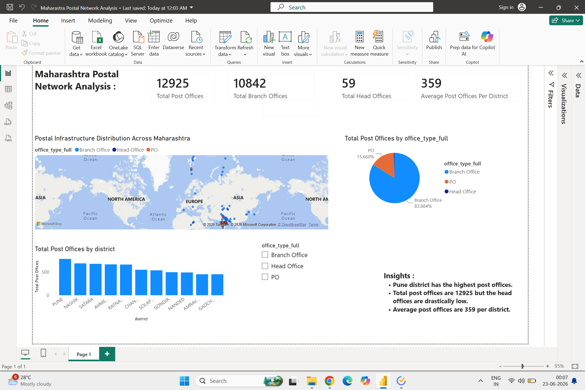

# Maharashtra Postal Network Analysis

## Project Overview

This project analyzes postal infrastructure distribution across Maharashtra using Python, Pandas and Power BI.

## Objectives

- Clean government postal data
- Analyze district-level infrastructure
- Identify infrastructure concentration
- Visualize postal network distribution

## Tools Used

- Python
- Pandas
- Google Colab
- Power BI
- GitHub

## Dataset

Source: India Post Office Directory

Records Analyzed: 12,925

Districts Covered: 36

## Key Findings

- Maharashtra contains 12,925 postal facilities.
- Pune has the highest postal infrastructure concentration.
- Branch Offices account for approximately 84% of all locations.
- Head Offices represent less than 1% of the network.
- Infrastructure distribution varies significantly across districts.

## Dashboard Preview

## Project Files

- notebook/Public_Policy_Project.ipynb
- dashboard/Maharashtra_Postal_Network_Analysis.pbix
- data/Cleaned_Maharashtra_Postal_Data.csv
